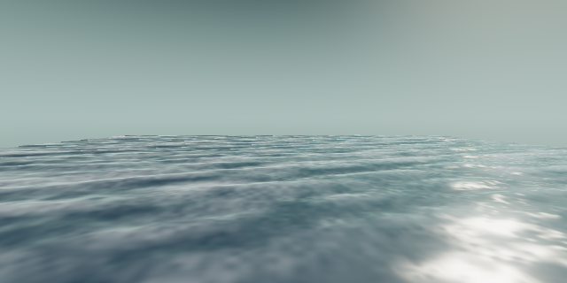
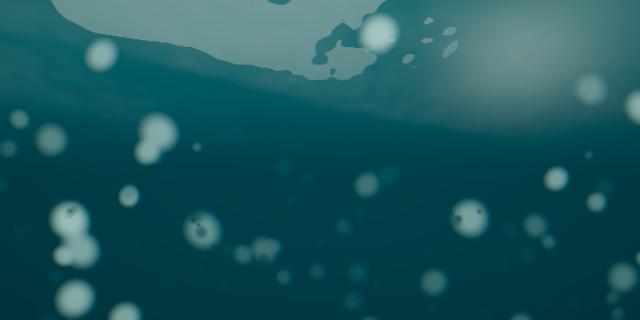

# 海水运动的基本方程——海浪动力学虚拟探索实验

一个面向高校海洋科学课程的沉浸式虚拟仿真教学 Web 应用。你将扮演**海洋动力实验员**：
面前是一片可以完全控制的 3D 虚拟海面——亲手调风速造出风浪、用两台造波机做波的
干涉实验、再闯进一片参数未知的随机海况；每个实验配科研任务，先做预测、再用虚拟
仪器（波高尺 / 秒表 / 随浪浮标）动手验证，最后导出一份自动生成的实验报告。
全部计算与素材都在浏览器本地完成，**无后端、无网络依赖、无任何 API key**。

## 界面预览

**实验一 · 风浪生成**（风速 15 m/s：重力波 + 太阳高光 + 白帽泡沫）



**水下仰视**（能见度衰减、太阳光束、悬浮颗粒与 Snell 窗亮天窗）



## 功能特性

- **三个递进实验**：风浪生成机制（风浪谱成长）→ 双造波机叠加（相长/相消/拍/格状干涉）→ 不规则随机海况（PM/JONSWAP 谱驱动）
- **六个科研任务闭环**：先填预测 → 动手操作 → 提交实时判定；判定阈值集中在单一文件，任务卡带语音引导
- **虚拟仪器**：波高尺（探针处峰谷高差）、秒表（周期/拍周期自动估计）、随浪浮标（行进波高序列）
- **科学图表**：探针 η(t) 时序、S(f) 能谱、波分量谱，与 3D 海面同一仿真时钟
- **实验报告**：一键导出 Markdown/JSON（参数快照、测量记录、任务达成表、预测与操作时间线、教学简化模型声明）+ 分享卡片 PNG
- **渲染管线**：自研 Gerstner 波形着色器（物理分量驱动）+ three 官方后处理链（ACES 电影级色调映射、高光/泡沫泛光、水下屏幕折射扭曲与色差）+ 浪尖透光（逆光 SSS 近似）+ 波面遮挡体积光（光柱随波形实时流动）+ 泡沫时间积累缓冲（波峰掠过后余沫留存数秒并随风漂移）
- **三种视角**：海面掠视 / 侧视剖面 / 水下仰视（能见度衰减、体积光柱、悬浮颗粒、Snell 窗）
- **教学细节**：水质点示踪（深水圆 → 浅水椭圆轨迹）、参数拖动全程连续无跳变（7s 波场平滑过渡）、同种子可复现随机海况

## 技术栈

| 项 | 选型 |
|---|---|
| 构建/开发服务器 | Vite 8（`base: './'`，产物可相对路径部署） |
| 语言 | TypeScript（strict 全开） |
| 3D 渲染 | Three.js 0.186（唯一 npm 运行时依赖） |
| UI / 图表 / 状态 | 全部手写：CSS 设计令牌、canvas/SVG 图表、pub/sub store。**不使用** UI 框架、状态库、图表库 |
| 测试 | Vitest 5（node 环境，9 个测试文件、197 个用例） |
| 素材 | 预生成音频/图片/视频（`public/assets/`），原生 `<audio>/<video>` 播放 |

## 快速开始

```bash
npm install        # 安装依赖（唯一运行时依赖 three）

npm run dev        # 开发服务器
npm run build      # tsc --noEmit && vite build，产物在 dist/
npm run preview    # 本地预览构建产物
npm run typecheck  # 仅类型检查
npm run test       # vitest run，全部测试一次跑完
npm run test:watch # vitest 监听模式
```

## 目录结构

```
├── index.html            # 应用入口（五区布局骨架：顶栏/左栏/右栏/底栏/3D 视口）
├── public/assets/        # 预生成素材（audio 10 段 / images 4 张 / video 5 条）
├── screenshots/          # README 界面预览图
├── src/
│   ├── main.ts           # 唯一组装点：模块初始化、事件接线、WebGL 降级兜底
│   ├── core/             # 类型、pub/sub store、仿真时钟、常数/参数范围
│   ├── physics/          # 物理层（色散/成长/谱/波场/水质点轨迹）
│   ├── render/           # Three.js 渲染层（海面着色器、三视角、示踪、粒子）
│   ├── experiments/      # 实验层（三实验编排、参数 clamp、滑块 schema）
│   ├── charts/           # 图表挂载契约
│   ├── viz/              # 科学图表实现（η(t) 时序、S(f) 能谱、分量谱）
│   ├── instruments/      # 虚拟仪器（波高尺/秒表/随浪浮标/峰值检测/环缓冲）
│   ├── tasks/            # 科研任务系统（判定器/阈值/面板/持久化）
│   ├── data/             # 实验报告生成与导出（Markdown/JSON/剪贴板）
│   ├── ui/               # UI 壳层（面板/加载/提示/媒体接入 media.ts）
│   └── styles/           # 设计令牌与全局样式（深海青绿色系）
└── tests/                # vitest 测试（core/physics/experiments/render/viz/
                          #   instruments/tasks/report/ui-logic 各一）
```

## 三个实验

| 实验 | 内容 | 关键参数 |
|---|---|---|
| **一 · 风浪生成机制** | 滑块控制风速/风时/风向，海面 1 秒内实时响应：平静 → 毛细波 → 重力波 → 白帽 → 局部破碎连续过渡。成长模型给出理论 Hs/Tp（固定教学风区 100 km） | 风速、风时、风向 |
| **二 · 双造波机叠加** | 两台造波机各自控制波高/周期/方向/初相位，演示相长、相消、拍、交叉格状干涉 | H/T/θ/φ × A、B 两台 |
| **三 · 不规则随机海况** | PM/JONSWAP 谱驱动的 48 分量随机海面，3D 海面 + 探针 η(t) 时序 + S(f) 能谱三视图同步；「未知海况」模式隐藏理论值供任务六使用 | 风速、风区、谱型、γ、随机种子 |

辅助观察：三种视角、水质点示踪（可冻结波形观察"质点绕圈、波形前行"）、
暂停/倍速/重置。

## 六个科研任务

每个任务都是"**先填预测 → 动手操作 → 提交判定**"的闭环；判定由学生提交触发，
阈值集中在 `src/tasks/taskDefs.ts`。任务卡展开后有「语音引导」按钮播放对应讲解音频。

| # | 任务 | 实验 | 通过条件（要点） |
|---|---|---|---|
| 一 | 白帽浪观测 | 一 | 风速 15–30 m/s，白帽强度 ≥ 0.3 且持续约 5 s，期间用波高尺记录一次 |
| 二 | 振幅最大（相长） | 二 | 两波同频同向、相位对齐，测量峰谷差 ≥ 单列波 × 1.8，保持约 4 s |
| 三 | 振幅归零（相消） | 二 | 两波等幅（差 ≤5%）、相位差 180°（±5°），残余峰谷差 ≤ 单列波 × 20% |
| 四 | 拍 | 二 | 周期失谐 \|ΔT\|/T̄ ∈ [0.1, 0.3]，用秒表测拍周期，与理论值 T₁T₂/\|T₁−T₂\| 偏差 ≤20% |
| 五 | 交叉格状波面 | 二 | 两波夹角 60°–120°，两波均可见（启发式），观察约 4 s 后提交 |
| 六 | 未知海况还原 | 三 | 未知海况模式下仅用仪器测量，提交 Hs/Tp 估计，误差 ≤15% / ≤20% |

进度与测量记录自动持久化，底栏可导出 Markdown/JSON 实验报告。

## 参数说明表

范围/步进/默认值的唯一来源：`src/core/constants.ts`。

### 实验一 · 风浪生成

| 参数 | 单位 | 范围 | 步进 | 默认 | 说明 |
|---|---|---|---|---|---|
| 风速 U | m/s | 0 – 30 | 0.5 | 8 | < 0.3 视为平静；≥15 出现白帽 |
| 风时 | min | 0 – 60 | 1 | 10 | 滑块直读语义（不随仿真时间自动累积） |
| 风向 | ° | 0 – 360 | 5 | 0 | 高级项；0° = 沿 +y 传播 |

### 实验二 · 双造波机叠加（A/B 各一套，同表）

| 参数 | 单位 | 范围 | 步进 | 默认 | 说明 |
|---|---|---|---|---|---|
| 波高 H₁/H₂ | m | 0.05 – 2 | 0.05 | 0.5 | UI 下界 0.05（物理层放宽到 0 支持关闭场景） |
| 周期 T₁/T₂ | s | 0.5 – 20 | 0.1 | 4 | |
| 方向 θ₁/θ₂ | ° | 0 – 360 | 5 | 0 | 夹角 60°–120° 得格状干涉 |
| 初相位 φ₁/φ₂ | ° | 0 – 360 | 5 | 0 | Δφ≈0 相长、≈180° 相消 |

### 实验三 · 不规则随机海况

| 参数 | 单位 | 范围 | 步进 | 默认 | 说明 |
|---|---|---|---|---|---|
| 风速 U | m/s | 2 – 30 | 0.5 | 10 | 19.5 m 高度等效风速 |
| 风区长度 F | m | 10,000 – 300,000 | 5,000 | 50,000 | 决定 JONSWAP 谱峰位置 |
| 谱型 | — | PM / JONSWAP | — | JONSWAP | 高级项 |
| 谱峰增强因子 γ | — | 1 – 7 | 0.1 | 3.3 | 高级项；仅 JONSWAP 有效 |
| 随机相位种子 | — | 0 – 99,999 | 1 | 42 | 高级项；同种子 ⇒ 同海况 |
| 未知海况模式 | 开关 | 开/关 | — | 关 | 高级项；隐藏理论值面板（任务六） |

固定常量：重力加速度 g = 9.81 m/s²，海水密度 1025 kg/m³，波分量上限 64
（实验一用 24、实验三用 48），理论 Hs 硬上限 10 m。水深默认深水（∞）。

## 预生成素材

教学引导与案例使用**预先制作的本地素材**（运行期零网络依赖），
由 `src/ui/media.ts` 以原生 `<audio>/<video>/canvas` 接入；
播放/加载失败静默降级，语音均由点击触发（开场视频除外：静音自动播放、可跳过）。

- **音频**（`public/assets/audio/`，10 段）：六任务语音引导 + 三段实验知识点讲解 + 开场欢迎语
- **图片**（`public/assets/images/`，4 张）：首屏氛围图、任务现象配图 ×2、分享卡片底图
- **视频**（`public/assets/video/`，5 条）：开场短片 + 四段现象案例（白帽破碎 / 交叉浪 / 波群 / 观测浮标）

## 环境变量

**本项目无必需环境变量**。无后端、无任何在线服务调用；构建、开发、运行均不需要
配置任何 key 或 token，仓库内不存在 `.env` 文件。

## 教学简化模型声明

本项目全部物理为**面向课堂的教学简化模型**，不能替代工程计算：

- **画面微观波光**：海面着色器含一层装饰性的微观涟漪法线扰动（无风镜面上也
  可见波光），属视觉细节，**不参与物理波形与仪器读数**（读数仍为理想镜面）。
- **后处理氛围效果**：高光泛光、水下折射扭曲/色差/暗角、ACES 色调映射均为
  屏幕空间的视觉增强，不改变任何物理量、波形与仪器读数。
- **泡沫积累与体积光**：泡沫包络由雅可比拥挤/波峰/白帽强度注入、指数衰减与
  风向漂移组成（时间积累缓冲）；体积光以波面几何为遮挡体做屏幕空间径向模糊——
  均为视觉增强，不改变物理量与仪器读数。
- **白帽判据**：0–1 强度指标是经验映射（局部陡度 60% + 风速门控 40% 加权），
  **不是实测的白帽覆盖率**。已知特性：固定风速下增大风时，波高增大但陡度略降，
  白帽指标可能小幅回落（"老年海更胖"），属预期行为。
- **线性波框架**：波形叠加为线性 Airy 波（实验二附加一阶 Gerstner 陡度修饰），
  无二阶及以上 Stokes 修正、无波-波非线性相互作用、无流-波耦合、无第三代谱模式
  （WAM/SWAN 类）的能量平衡方程。
- **风浪成长**：SPM/JONSWAP 幂律简化；实验一使用固定教学风区 100 km（无风区滑块）；
  风时为滑块直读语义，不随仿真时间自动累积；理论 Hs 硬上限 10 m。
- **JONSWAP 谱为教学版**：省略标准谱的归一化系数项；PM 谱风速不建模观测高度换算。
- **随机海况为有限离散**：48 分量（频带 0.5fp–4fp、方向 cos² ±45°），
  非全频段全方向随机海；Hs = 4√m₀ 为窄谱统计近似。
- **质点轨迹为一阶（线性）解**：深水圆 / 有限水深椭圆，非精确速度势解。
- **任务五为启发式判定**：「两波均可见」与观察时长是近似准则，判定结果供参考
  （学生端任务卡内有注明）。
- **渲染兜底**：WebGL 不可用时降级为说明页 + 仅推进时钟的兜底循环，
  2D 图表与任务闭环仍可用；波分量上限 64（渲染 uniform 硬限制）。

## 致谢

- [three.js](https://github.com/mrdoob/three.js) — 3D 渲染
- [abyssal-ocean](https://github.com/squall01337/abyssal-ocean)（MIT）— 水下 Snell 窗与浪尖透光着色器片段参考
- three.js 官方 addons（EffectComposer / UnrealBloomPass / OutputPass）— 后处理管线

## 许可证

[MIT](LICENSE)
